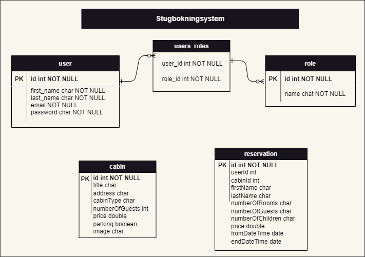
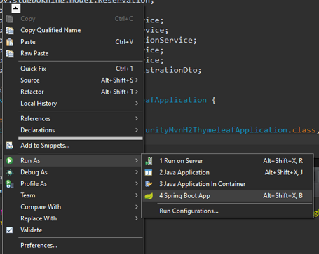
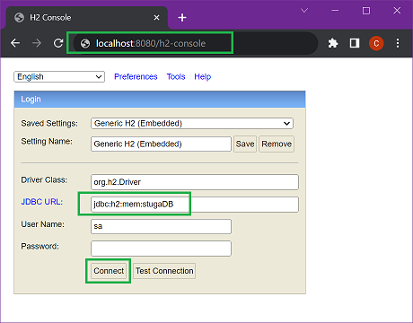
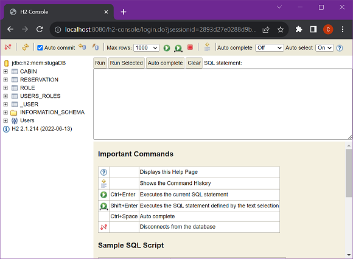

# Stugbokningssystem

* [User Story](#user-story)
	* [Data Model](#data-model)
* [Applikationen](#applikationen)
	* [Om Applikationen](#om-applikationen)
	* [Startar Applikationen](#startar-applikationen)
* [Databas](#databas)
    * [H2 Console](#h2-console)
* [Web](#web)
    * [Registrering](#registrering)
	* [Logga in](#logga-in)
	* [Övriga sidor](#övriga-sidor)
* [API](#api)
    * [End Points](#end-points)
    

## User Story
- Som en turist vill jag kunna boka en stuga via webben och få en bekräftelse på att stugan är bokad.
- Som en administratör vill jag kunna se alla bokningar av stugor.

### Data Model



## Applikationen

### Om Applikationen
Här i applikationen har jag använt-
1. IDE: Spring Tool Suite 
2. In mmory databas: H2 
3. Backend: Java 
4. Frontend: Thymeleaf

### Startar Applikationen
Ladda ner applikationen från ([Github repository](https://github.com/dchotan/arbetsprov)).

För att starta applikationen skriv från command-prompt:

```console
$ mvn spring-boot:run
```

Eller kör programmet som Spring Boot App




[Stugbokningssystem](#stugbokningssystem)

## Databas

### H2 Console

Viktig uppgifter:
1. Länk: http://localhost:8080/h2-console
2. Databas: stugaDB
3. UN: sa
4. Pass:

#### Anslutningsdatabas



#### Efter anslutningsdatabas



[Stugbokningssystem](#stugbokningssystem)

## Web

Gå till http://localhost:8080/

Det finns ett pre-defined admin konto:

	Användarnamn: admin@mail.com
	Lösenord: admin

### Registrering

### Logga in

### Övriga sidor

## API

### End Points


Method	| URL	| JSON Object (Example)	| Description	| Parameters | Returns| User Authentication | Available for UI
------- | ----- | ------------- |:-------------:|:----------:|:-------:|:-------:|:-------:|
POST|http://localhost:8080/ads-service/add-new-ad| [JSON](#add-new-ads) | Add a new ad to the ads service  | | | Yes | Yes|
GET|http://localhost:8080/ads-service/get-all-ads| | Get all the ads from the ads service   |  | All [JSON](#get-all-ads) data from ads DB| Yes | |


