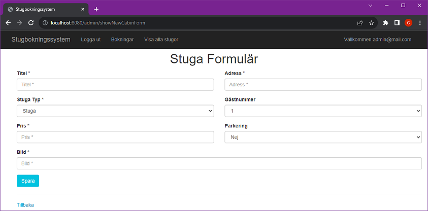

# Stugbokningssystem

* [User Story](#user-story)
	* [Data Model](#data-model)
* [Applikationen](#applikationen)
	* [Om Applikationen](#om-applikationen)
	* [Startar Applikationen](#startar-applikationen)
* [Databas](#databas)
    * [H2 Console](#h2-console)
* [Web](#web)
    * [Registrering](#registrering)
	* [Logga in](#logga-in)
	* [Övriga sidor](#övriga-sidor)
    

## User Story
- Som en turist vill jag kunna boka en stuga via webben och få en bekräftelse på att stugan är bokad.
- Som en administratör vill jag kunna se alla bokningar av stugor.

### Data Model


## Applikationen

### Om Applikationen
Här i applikationen har jag använt-
1. IDE: Spring Tool Suite 
2. In memory databas: H2 
3. Backend: Java 
4. Frontend: Thymeleaf

### Startar Applikationen
Ladda ner applikationen från ([Github repository](https://github.com/dchotan/arbetsprov)).

För att starta applikationen skriv från command-prompt:

```console
$ mvn spring-boot:run
```

Eller kör programmet som Spring Boot App


## Databas

### H2 Console

Viktig uppgifter:
1. Länk: http://localhost:8080/h2-console
2. Databas: stugaDB
3. UN: sa
4. Pass:

#### Anslutningsdatabas


#### Efter anslutningsdatabas


## Web

Gå till http://localhost:8080/

Det finns ett pre-defined admin konto:

	Användarnamn: admin@mail.com
	Lösenord: admin
	
Här använder vi Spring Boot Security för att hantera användare och roll. Vi har två roller ADMIN och USER.
	


### Registrering

Användare kan registrera sitt konto via "Registrera här" länken (http://localhost:8080/registration)


och få en bekräftelse på att "Registrerad!" efter trycker på "Registrera" knappen.


### Logga in

Användare kan gå till inloggningssidan (http://localhost:8080/login) via länken "Logga in här" och kan logga in genom att ange sin e-postadress och sitt lösenord.


### Övriga sidor

Det finns några stugor eller hus i databasen.

#### Som USER

Användare kan boka och se sina bokningar.


Bokning formulär


Användare får en bekräftelse på att stugan är bokad.


På mina bokningar kan användare se sina bokningar.


#### Som ADMIN

Admin kan:
1. Skapa en ny stuga
2. Redigera stugor
3. Ta bort stugor


Skapa en ny stuga.


Stuga formulär



Redigera en stuga.


ADMIN kan se alla bokningar av stugor.


